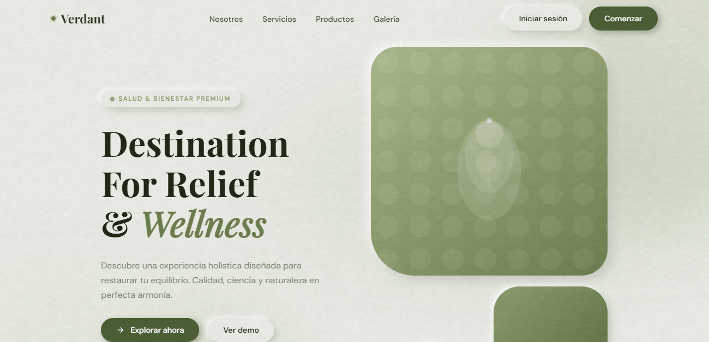

# 🌿 Verdant — Landing Page

> Maqueta web moderna tipo SaaS con estilo neomórfico en tonos verde olivo. Construida con HTML, CSS y JavaScript vanilla — sin frameworks ni librerías externas.


---

## 📋 Tabla de contenidos

- [Vista general](#-vista-general)
- [Características](#-características)
- [Tecnologías](#-tecnologías)
- [Estructura del proyecto](#-estructura-del-proyecto)
- [Instalación y uso](#-instalación-y-uso)
- [Secciones de la página](#-secciones-de-la-página)
- [Paleta de colores](#-paleta-de-colores)
- [Tipografía](#-tipografía)
- [Animaciones](#-animaciones)
- [Responsive design](#-responsive-design)
- [Contribución](#-contribución)
- [Licencia](#-licencia)

---

## 🌐 Vista general
## 📱Vistas


**Verdant** es una maqueta de landing page de alto rendimiento orientada a marcas de salud, bienestar y lifestyle premium. El diseño combina un sistema neomórfico coherente con una paleta de verde olivo no saturada, tipografía editorial y microinteracciones fluidas — todo construido en un único archivo HTML sin dependencias de build.

---

## ✨ Características

- **100% vanilla** — sin frameworks, sin librerías, sin bundler
- **Neomorfismo** — sombras suaves dobles (luz y sombra) en todos los componentes
- **Scroll reveal** — elementos que aparecen al hacer scroll con `IntersectionObserver`
- **Tilt 3D** en hover de cards con perspectiva CSS
- **Contadores animados** con easing cúbico al entrar al viewport
- **Parallax** suave en los blobs del hero
- **Grain texture** generada dinámicamente con Canvas API
- **Menú móvil** con hamburger animado
- **Nav adaptativa** que cambia de estilo al hacer scroll
- **Progress bars** animadas al entrar al viewport
- **Archivo único** — todo en un solo `index.html`, fácil de desplegar

---

## 🛠 Tecnologías

| Tecnología | Uso |
|---|---|
| **HTML5** | Estructura semántica y accesible |
| **CSS3** | Variables, Grid, Flexbox, animaciones, media queries |
| **JavaScript ES6+** | IntersectionObserver, Canvas API, eventos DOM |
| **Google Fonts** | Tipografías Playfair Display y DM Sans |
| **SVG** | Ilustraciones, iconos y patrones inline |
| **Canvas API** | Textura grain animada sobre la página |

No se utilizan frameworks (React, Vue, Angular), librerías CSS (Bootstrap, Tailwind) ni herramientas de build (Webpack, Vite).

---

## 📁 Estructura del proyecto

```
verdant/
│
├── index.html          # Archivo principal — contiene HTML, CSS y JS
└── README.md           # Este archivo
```

Al ser un proyecto de archivo único, toda la lógica, estilos y estructura residen en `index.html`. Esto facilita el despliegue inmediato en cualquier hosting estático.

---


Luego visita `http://localhost:----` en tu navegador.

---

## 📄 Secciones de la página

| # | Sección | Descripción |
|---|---|---|
| 1 | **Nav** | Barra fija con efecto blur al hacer scroll y menú hamburger móvil |
| 2 | **Hero** | Titular principal, estadísticas con contador, shapes SVG y tarjeta flotante |
| 3 | **Brands** | Barra de logos de marcas aliadas con efecto neomórfico |
| 4 | **About** | Sección "Nosotros" con shapes verticales y bloques Visión/Misión |
| 5 | **Services** | Grid de 3 cards de servicios con hover animado |
| 6 | **Products** | Círculos multimedia estilo video thumbnails con overlay |
| 7 | **Feature Split** | Panel oscuro (calzado) + panel claro (bebidas) en diseño dividido |
| 8 | **Performance** | Cards con progress bars y chips de características |
| 9 | **Gallery** | Galería oscura con layout asimétrico y overlay en hover |
| 10 | **CTA** | Bloque de conversión con fondo verde olivo profundo |
| 11 | **Footer** | 4 columnas: marca, servicios, empresa y legal |

---

## 🎨 Paleta de colores

Todos los colores se definen como variables CSS en `:root` para facilitar la personalización.

| Variable | Valor | Uso |
|---|---|---|
| `--bg` | `#e8ebe4` | Fondo principal |
| `--bg-deep` | `#dde1d8` | Fondo de secciones alternas |
| `--olive-900` | `#2d3821` | Texto principal, fondo footer |
| `--olive-700` | `#4a5c33` | Botones primarios, acentos |
| `--olive-500` | `#6b7c4e` | Acentos medios, bordes activos |
| `--olive-400` | `#8a9b6a` | Labels, iconos secundarios |
| `--olive-300` | `#aab98a` | Decoraciones, textos en dark |
| `--olive-100` | `#d4dcca` | Separadores, bordes sutiles |
| `--shadow-dark` | `#c4c9be` | Sombra oscura neomórfica |
| `--shadow-lite` | `#ffffff` | Sombra clara neomórfica |

### Sombras neomórficas

```css
--neo-out:  6px 6px 14px var(--shadow-dark), -4px -4px 10px var(--shadow-lite);
--neo-in:   inset 3px 3px 8px var(--shadow-dark), inset -3px -3px 7px var(--shadow-lite);
--neo-card: 8px 8px 20px var(--shadow-dark), -6px -6px 16px var(--shadow-lite);
--neo-btn:  4px 4px 10px var(--shadow-dark), -3px -3px 8px var(--shadow-lite);
```

---

## 🔤 Tipografía

| Fuente | Peso | Uso |
|---|---|---|
| **Playfair Display** | 400, 700, italic | Títulos h1–h4, logo, números destacados |
| **DM Sans** | 300, 400, 500, 600 | Cuerpo de texto, labels, botones, nav |

Importadas desde Google Fonts con `preconnect` para reducir latencia:

```html
<link rel="preconnect" href="https://fonts.googleapis.com">
<link rel="preconnect" href="https://fonts.gstatic.com" crossorigin>
<link href="https://fonts.googleapis.com/css2?family=Playfair+Display:ital,wght@0,400;0,700;1,400&family=DM+Sans:wght@300;400;500;600&display=swap" rel="stylesheet">
```

---

## 🎞 Animaciones

| Animación | Técnica | Descripción |
|---|---|---|
| Scroll reveal | `IntersectionObserver` + CSS | Elementos aparecen al entrar al viewport con delay escalonado |
| Tilt 3D | `mousemove` + `perspective` CSS | Cards se inclinan según la posición del cursor |
| Contadores | `requestAnimationFrame` + easing cúbico | Números suben desde 0 al valor objetivo |
| Float | CSS `@keyframes` | Tarjeta hero flota suavemente en loop |
| Parallax | `scroll` event + `translateY` | Blobs del hero se mueven a diferente velocidad |
| Grain | Canvas `ImageData` + `setInterval` | Textura de ruido animada sobre toda la página |
| Blobs | CSS `@keyframes drift` | Formas de fondo se desplazan suavemente |
| Nav blur | CSS `backdrop-filter` | Nav gana blur y sombra al hacer scroll |
| Hamburger | CSS `transform` inline | Las 3 líneas rotan y forman una X |

### Easings utilizados

```css
--ease:     cubic-bezier(0.25, 0.46, 0.45, 0.94);
--ease-out: cubic-bezier(0.0, 0.0, 0.2, 1);
--spring:   cubic-bezier(0.34, 1.56, 0.64, 1);
```

---

## 📱 Responsive design

| Breakpoint | Ancho | Cambios principales |
|---|---|---|
| **Desktop** | > 1024px | Layout completo de 2 columnas, nav con links visibles |
| **Tablet** | 768px – 1024px | Grid de 1 columna, feature split apilado verticalmente |
| **Mobile** | < 768px | Hamburger menu, servicios en 1 columna, shapes decorativos ocultos |
| **Small** | < 480px | Stats hero en columna, about visual simplificado |

---


Hecho con ♥ en México ·// © 2025–2026 Joana Uribe — Todos los derechos reservados.
// Uso, copia o distribución sin autorización escrita está prohibido.

</div>
